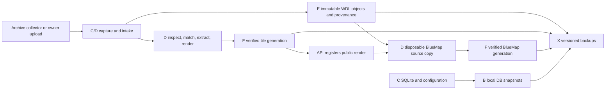

# From a ZIP to a point on the map

A WDL is the useful part. The PNG is how you find it again.

Atlas keeps the original save, figures out what chunks it actually contains, and
publishes a render at those coordinates. The Archive collectors are one way to
feed that process. A hand-uploaded old base save works too. You do not need six
Minecraft accounts, BlueMap, or a rack full of disks to test one WDL.

This is the short route through the source. For a complete host installation,
including HTTPS, permissions and backups, use [DEPLOY_FROM_SCRATCH.md](DEPLOY_FROM_SCRATCH.md).

## What lives where



Those letters describe example host, not a required hardware shopping list. On another
machine, choose local paths for intake/work and change the examples together.
Work and publication can be on different volumes: Atlas copies completed tiles to
private staging at the destination, verifies every byte, then renames that staging
directory into place. Do not serve the work directory.

E receives finished source artifacts and serves them. Extraction, rendering,
thumbnail generation and partial survey work belong on C/D. F is the published
map origin. X is out of the ingestion hot path. The original X copies retained
during migration are rollback material, not another queue to ingest.

## 1. Build the actual pipeline

Use Windows, the .NET SDK in `global.json`, and PowerShell. The coverage companion
also needs Java 21; BlueMap needs Docker with Linux containers. The inspector and
worker are .NET; there is no hidden Python downloader doing the real work elsewhere.
Some operator/media tools do use Python 3.10+, Pillow or sqlite3 CLI as documented
in their runbooks.

```powershell
git clone https://github.com/bobymicjohn/2b2tAtlas-Public-API.git C:\Source\2b2tAtlas-Public-API
Set-Location C:\Source\2b2tAtlas-Public-API\examples\atlas-stack
dotnet restore .\2b2tAtlas.sln
dotnet build .\2b2tAtlas.sln -c Release --no-restore
dotnet test .\2b2tAtlas.sln -c Release --no-build
.\scripts\publish-atlas-api.ps1 -OutputDirectory C:\AtlasExample\Api\app
.\scripts\publish-ingestion-worker.ps1 -OutputDirectory C:\AtlasExample\Ingest\worker
```

The publish helpers refuse existing output directories. For an upgrade, build into
a new `app-next-*`/`worker-next-*` directory and use the deployment runbook. Do not
publish over an executable that is processing a world.

## 2. Give it a database and credentials

Create `C:\AtlasExample\Api\data`, `C:\AtlasExample\Api\config`, `C:\AtlasExample\Ingest\config`,
`D:\AtlasExample\Ingest\intake`, `D:\AtlasExample\Ingest\work`,
`E:\AtlasExample\WorldDownloads` and `F:\AtlasExample\AtlasTiles`.
Run the API with `C:\AtlasExample\Api\data` as its working directory. Startup creates and
upgrades `atlas.db`; an existing production corpus must be restored separately.

The current owner policy is deliberately tied to account 1, `atlas-owner`.
Fresh-database seeding creates that account first. If you are adapting Atlas for a
different owner, review `AtlasSessionValidator`, `DatabaseSeeder` and the owner
tests together. Renaming a role does not transfer ownership.

Configure a random JWT signing key and a separate random worker credential. Keep
the raw worker key in `ATLAS_INGEST_WORKER_KEY` for the worker account; the API gets
only its SHA-256 in `IngestionWorker__ApiKeySha256`. Exact generation commands are
in [WDL_WORKER_DEPLOYMENT.md](WDL_WORKER_DEPLOYMENT.md#worker-credential).

Set these additional API values in its private launcher environment:

```text
ASPNETCORE_URLS=http://127.0.0.1:5297
IngestionWorker__IntakeRoot=D:\AtlasExample\Ingest\intake
WdlArchive__Root=E:\AtlasExample\WorldDownloads
Recovery__Root=B:\AtlasExample\Backups\human-edits
Recovery__DatabasePath=C:\AtlasExample\Api\data\atlas.db
```

Use a writable recovery directory with at least 10 GiB free. Human writes return
503 if their pre-edit database checkpoint cannot be verified. On a smaller test
host, put recovery somewhere sensible on a local disk and set `Recovery__Root`
explicitly. The protected upload/queue controls are owner-only; an Archivist role
does not grant them.

Minimal launchers are in [deploy/examples](../deploy/examples/README.md). They
load private environment files and launch the published binaries. They do not
contain passwords or know anything about your Minecraft accounts.

## 3. Pin the renderer, then start one worker

Copy `2b2tAtlas.Ingestor/examples/worker.example.json` to
`C:\AtlasExample\Ingest\config\worker.json`. Change `apiBase`, filesystem roots and
`publicTileRoot` for your host. Copy `renderer-profile.example.json` beside it as
`renderer.json`.

Get uNmINeD from its author, check the exact executable version and SHA-256, and
put that digest in the renderer profile. The example's placeholder is supposed
to fail. Each dimension has its own command arguments; a random GUI build is not
interchangeable with the CLI binary used by the profile.

```powershell
Get-FileHash C:\AtlasExample\Ingest\tools\unmined-cli.exe -Algorithm SHA256
C:\AtlasExample\Ingest\worker\2b2tAtlas.Ingestor.exe worker `
  --config C:\AtlasExample\Ingest\config\worker.json --once true
```

Queue a small known WDL using **Admin → Location Management → Add Location → From
World Download** as the owner. Use its real dimension and historical date. Let an
ambiguous match stop at `needs-match`; picking the nearest famous base is how you
end up with half the server attributed to Mu.

Check the job state, exact chunk bounds and public tile before leaving the worker
in continuous mode (omit `--once true`). Configure the tile origin at
`publicTileRoot` first. A registered URL pointing at an unserved folder is not a
working deployment.

The standalone CLI stages and input manifests are documented in
[INGESTION_PIPELINE.md](INGESTION_PIPELINE.md). Start with `inspect` when examining
an unfamiliar save. ZIP validation is not proof that the save came from 2b2t.

## 4. Add The Archive as an upstream source

Start with one stopped, isolated collector profile. Install the reviewed stack
and build the companion from this checkout:

```powershell
.\scripts\install-archive-collector-toolchain.ps1 `
  -InstallRoot C:\AtlasExample\Ingest\archive-sync\collector
.\scripts\build-archive-coverage-mod.ps1 `
  -InstallRoot C:\AtlasExample\Ingest\archive-sync\collector -Install
```

The build helper downloads a SHA-pinned Gradle wrapper and builds the complete
Java source in `tools/AtlasArchiveCoverage`. Its `build` task runs 12,000
differential coverage cases. Use `-Java` if Java 21 is elsewhere. No prebuilt
private JAR is required. `-Install` is for a stopped profile; running profiles
use the pending-mod manifest and safe-boundary reload mechanism instead.

Authenticate HeadlessMc interactively as your own Minecraft account and follow
the [catalog/capture runbook](ARCHIVE_SYNC_AUTOMATION.md). Each concurrent lane
needs a different authenticated account and its own profile. Copying an account
cache into six folders creates six clients kicking each other off the server.

The important chain is:

| Step | Entry point |
| --- | --- |
| Install pinned client dependencies | `install-archive-collector-toolchain.ps1` |
| Build coverage companion and its tests | `build-archive-coverage-mod.ps1` |
| Discover catalog / prepare queue | `get-archive-warp-catalog.ps1`, `new-archive-collector-queue.ps1` |
| Capture one isolated profile | `invoke-archive-collector.ps1` |
| Coordinate independent lanes | `invoke-archive-parallel-collector.ps1` |
| Refill fast lanes / share survey hints | `archive-fast-lane-refill.ps1`, `archive-survey-handoff.ps1` |
| Preserve completed raw/footprint artifacts on E | `archive-collector-captures.ps1` |
| Apply the final-standard acceptance policy | `promote-archive-adaptive-batch.ps1` |
| Submit just this accepted batch | `import-archive-inbox.ps1` |
| Run archive → promotion → import continuously | `invoke-archive-rolling-handoff.ps1` |
| Resume surviving clients / finish safely | `resume-archive-parallel-supervisor.ps1`, `stop-archive-collector-at-checkpoint.ps1` |

These files and their helpers are in [`scripts`](../scripts). They include
example host defaults, dated run roots and example account names. Read their parameter
blocks and pass your paths; do not launch a production-named finalizer against a
different queue. One supervisor owns a run. One rolling handoff imports it.

Fast lanes refill with small jobs and borrow long work when that queue is empty.
They switch back at a completed WDL boundary. A fast-to-long checkpoint preserves
the downloaded terrain and surveyed void cells. The long lane restores that
coverage, visits missing areas, and combines old/new chunks before the independent
saved-ZIP/footprint audit. Older partials recover terrain too; their unrecorded
void cells still need surveying. See [capture resume](COLLECTOR_RECOVERY.md).

## 5. Add 3D, enrichment and backups

BlueMap reads completed source-backed renders. It stages a source copy on D,
repairs lighting, removes generated neighbor chunks, audits the exact footprint,
and publishes to F. The coordinator has three isolated slots with shared memory
admission. A broken 3D retry cannot undo a valid 2D render. Follow
[BLUEMAP_PIPELINE.md](BLUEMAP_PIPELINE.md) before starting the backfill.

Group attribution first uses reviewed deterministic warp/name evidence. AI/wiki
research can add sourced proposals; the model is not the authority on who built
something. See [GROUP_ENRICHMENT_RUNBOOK.md](GROUP_ENRICHMENT_RUNBOOK.md).

The backup scripts cover the part a Git clone cannot recreate: the database,
source WDLs, raw capture evidence, attachments and published render trees.
`backup-atlas-db.ps1` makes verified online SQLite snapshots.
`backup-atlas-preservation.ps1` contains example host's Restic roots, password-file
path, free-space floors and Metadata/Assets/Preservation tiers. Adapt those before
registering it on another host. Local B snapshots and NAS X copies serve different
failure cases. A checksum beside a lost file is not a backup.

`restore-atlas-record.py` supports targeted record recovery; read its preview and
apply contract first. `watch-atlas-storage-completion.py` is the one-time example host
migration monitor, not a prerequisite for a new installation. It has deliberately
specific completion markers and NAS expectations. Historical `complete-atlas-*`
migration scripts are included for audit/recovery, not as fresh-install steps.

## Before feeding it the entire catalog

Verify one WDL all the way through: preserved object, D work receipt, correct
dimension and footprint, registered render, public PNG, matching range download.
Then restore that WDL and a SQLite snapshot from the backup destination. Watch
actual chunk/job progress as well as process liveness. A Java process can be alive
for hours while doing absolutely nothing useful.

The repeatable checks live beside the code: the .NET test project,
`scripts/tests/test-archive-*.ps1`, `test-atlas-bluemap-coordination.ps1`, and the
coverage companion's Java tests. Live probes and mutation/recovery scripts are
separate; do not run every file named `test-*` against production as a test suite.
