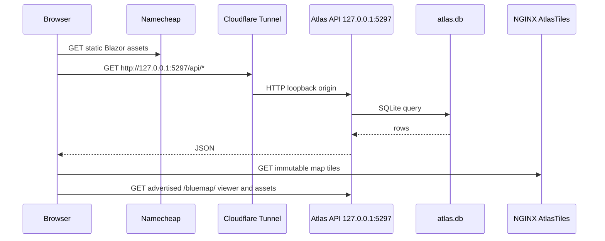

# Runtime And Deployment Topology

> **AI-Generated documentation.**

## Scope

This file identifies runtime hosts, ports, storage, and request paths. Deployment procedures remain in `docs/DEPLOYMENT_TOPOLOGY.md` and `docs/WDL_WORKER_DEPLOYMENT.md`.

## Production Topology

| Surface | Runtime | Address or storage |
| --- | --- | --- |
| Static client | Namecheap Apache/cPanel | `https://atlas.example` document root |
| Atlas API | example host native Windows process | `127.0.0.1:5297`, public as `http://127.0.0.1:5297` |
| SQLite | Atlas API working directory | `C:\AtlasExample\Api\data\atlas.db` |
| WDL intake drive | Dedicated data volume (shared by API and worker) | `D:\AtlasExample\Ingest\intake` |
| Archive acquisition | Five isolated native headless Minecraft workers | `C:\AtlasExample\Ingest\archive-sync\collector`, `C:\AtlasExample\Ingest\archive-sync\collectors\*` |
| Archive catalog/state | Private JSON checkpoints | `C:\AtlasExample\Ingest\archive-sync\archive-warp-catalog.json`, `collector-state.json` |
| Archive capture boundary | C transient game saves/state, D fast capture staging, X hash-verified durable collector archive, then explicit inbox | `C:\AtlasExample\Ingest\archive-sync` -> `D:\AtlasExample\Ingest\archive-captures` -> `E:\AtlasExample\WorldDownloads\collector` -> `ready` |
| Worker package/config | example host filesystem | `C:\AtlasExample\Ingest\worker`, `C:\AtlasExample\Ingest\config` |
| Worker staging | Dedicated data volume | `D:\AtlasExample\Ingest\work` |
| Published tiles | Windows host plus Docker NGINX read | `F:\AtlasExample\AtlasTiles` -> `/usr/share/nginx/html/AtlasTiles` |
| Tile origin | NGINX through Cloudflare | `https://tiles.atlas.example/AtlasTiles` |
| BlueMap scratch/state | Disposable D work plus C checkpoint/lock | `D:\AtlasExample\Ingest\bluemap-work`, `C:\AtlasExample\Ingest\bluemap` |
| BlueMap immutable output | Atlas API read-only static origin | `F:\AtlasExample\AtlasBlueMap\location-renders` -> `http://127.0.0.1:5297/bluemap/` |

**Production:** Namecheap contains public static files only. It must not contain server binaries, `atlas.db`, secrets, WDLs, renderer tools, work trees, or generated tile staging.

## Public Browse Flow

The API process uses `HostStaticClient=false` in production. `2b2tAtlas.Server/Program.cs` otherwise supports combined hosting for local development.

## WDL Flow

The owner account (with `renders.manage` and the non-delegable owner check) signs in to the production Atlas client from any machine and uploads a ZIP through the resumable endpoints below `http://127.0.0.1:5297/api/ingestion-jobs/upload-sessions` with a bearer JWT. The API assembles ordered chunks on `D:\AtlasExample\Ingest\intake`, verifies the source into the SHA-addressed E: archive, and queues a job. The example host worker claims the job, inspects it, renders day and night, and publishes both beneath one immutable generation under `F:\AtlasExample\AtlasTiles` before submitting completion metadata.

WDL bytes transit `api.atlas.example` to reach the intake drive but never traverse Namecheap, SQLite, or BlackBrain, and are never extracted or rendered by the API. Re-renders resolve the original source by archived SHA; they do not depend on the transient intake copy.

The Archive collector is a second upstream path on example host. It connects outbound to `thearchive.world` with five isolated device-code-authenticated Minecraft profiles, catalogs `/warps`, and saves official downloader ZIPs locally. The initial pass uses five staggered workers over disjoint, location-grouped queue shards. Each client owns its install, game, saves, cache, logs, auth, queue, and state paths—tokens and mutable game directories are never shared. C holds only active client files and resumable JSON/log state; validated captures and derived footprints are written to fast D staging. After capture, `archive-collector-captures.ps1` copies them to X with source/destination SHA-256 verification and only then rewrites the canonical paths to the NAS tier. The supervisor merges durable checkpoints into canonical state and can restart a transiently failed worker without replaying final-standard warps. Cataloging and capture cannot enqueue Atlas work directly. A capture crosses into normal ingestion only through NAS archival, the strict adaptive promoter, `ready`, and `import-archive-inbox.ps1`; successful intake is also deduplicated into `E:\AtlasExample\WorldDownloads\objects` by SHA-256. Rendering work and published tiles remain on F. Exact retry reconciliation is hash/slug/intake-bound. After the initial pass and production handoff are both complete, `2b2t Atlas Archive Weekly Sync` runs Sundays at 06:00, checks the live catalog, and processes only new/unresolved identities. Until then it exits as a recorded no-op. Weekly runtime state is isolated beneath `C:\AtlasExample\Ingest\archive-sync\weekly`.

Operational override (2026-09-01): `invoke-archive-rolling-handoff.ps1` now watches canonical v2 checkpoints every 15 seconds. It SHA-verifies each completed capture from D into X, applies the strict promoter, and submits it through the normal importer without waiting for the catalog pass to end. Constantiam/3b3t provenance is rejected explicitly; there is no longer a 100k origin-distance gate. This supersedes the end-of-pass handoff wording above.

Completed source-backed render records are consumed independently by the
BlueMap coordinator, kept alive by the five-minute watchdog. Three memory-gated workers
relight and exact-audit disposable world copies and serialize publication of
validated immutable 3D generations on F using shared storage reservations.
BlueMap never changes ingestion completion and never mutates X source objects.
New renders are discovered every minute; failed jobs have a 30-minute cooldown.
Admin exposes independent worker activity/stage and catalog-wide counts. See
[`../BLUEMAP_PIPELINE.md`](../BLUEMAP_PIPELINE.md).

## Runtime Configuration

API settings are read by `2b2tAtlas.Server/Program.cs` and controllers:

- `ASPNETCORE_URLS=http://127.0.0.1:5297`.
- `HostStaticClient=false`.
- `JwtSettings__SecretKey`.
- `Cors__AllowedOrigins__0` and subsequent entries.
- `IngestionWorker__ApiKeySha256`.
- `IngestionWorker__IntakeRoot` (the dedicated `D:` intake drive shared with the worker).
- `MapRenders__AllowedUrlPrefixes__0` and subsequent entries.
- `BlueMap__OutputRoot`, `BlueMap__RequestPath`, and `BlueMap__PublicOrigin`.
- `BlueMap__CatalogCacheSeconds` and `BlueMap__MinimumProfileVersion`.
- `BlueMap__StatusPath`, `BlueMap__ActivityLogPaths__0` and subsequent entries,
  and `BlueMap__StatusStaleAfterMinutes`.

The client public setting is `ApiBaseUrl` in the packaged `appsettings.json`. Worker fields are validated in `2b2tAtlas.Ingestor/Worker/WorkerOptions.cs`.

## Filesystem Invariants

The API resolves `atlas.db` from its current working directory. Application rollback directories must remain separate from `C:\AtlasExample\Api\data`.

Worker `workRoot` and `publishRoot` must share a volume for atomic publication; intake, work, and publish roots must not overlap. NGINX should read the final tree and not write it.

BlueMap uses X only as immutable input, D for disposable extraction/tool caches,
C for its atomic lock/checkpoint/log state, and F for immutable public
generations. The API identity has read-only access to the BlueMap output root.
Do not place its scratch tree under an ingestion intake/promotion directory.

## Optional And Future Services

**Optional:** BlackBrain is outside the Atlas request path. It may consume generated documentation/catalog artifacts on its own schedule.

**Future:** a dedicated Atlas-to-BlackBrain endpoint is not part of this topology. If added, it must be private or loopback, authenticated with a dedicated credential, and limited to structured read-only enrichment suggestions.
