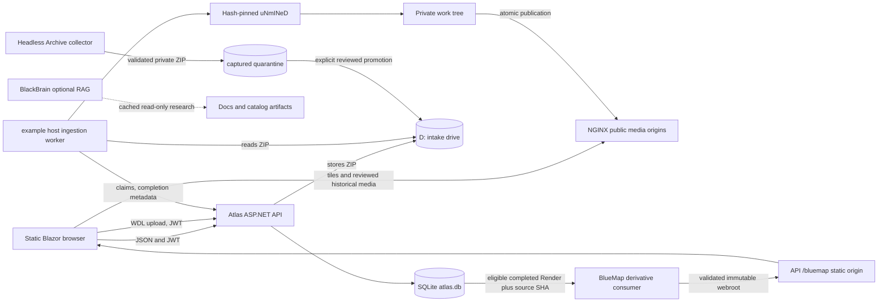

# System Overview And Components

> **AI-Generated documentation.**

## Scope

This file answers what Atlas components exist and where responsibility changes hands. Runtime addresses belong in `RUNTIME_TOPOLOGY.md`; endpoint contracts belong in `API_COMPATIBILITY.md`.

## Production Product Surface

**Production:** 2b2t Atlas is a Blazor WebAssembly location directory, Leaflet map, highway editor, administration surface, and reviewed WDL tile publication system. Public browsing includes locations, groups, approved public highways, attributed historical attachment media, global map renders, per-location sparse renders, optional quality-gated BlueMap 3D derivatives, search, measurement, share links, and browser-generated waypoint exports.

Primary UI owners:

- `2b2tAtlas.Client/Pages/Home.razor`: directory.
- `2b2tAtlas.Client/Pages/Map.razor`: map orchestration and tools.
- `2b2tAtlas.Client/Pages/Admin.razor`: permission-gated administration.
- `2b2tAtlas.Client/wwwroot/js/atlas-map.js`: Leaflet state, coordinates, layers, and performance behavior.

## Component Responsibilities

| Component | Responsibility | Must not own |
| --- | --- | --- |
| `2b2tAtlas.Client` | Static .NET 10 Blazor WASM UI, Radzen controls, API clients, Leaflet interop | SQLite, secrets, WDL extraction |
| `2b2tAtlas.Server` | ASP.NET Core API, JWT/RBAC, validation, audit, SQLite, job coordination, WDL upload intake to the shared drive, tile proxy | Rendering or extracting untrusted WDLs |
| `2b2tAtlas.Shared` | DTOs, enums, validators, permission and role constants | Host-specific state |
| `2b2tAtlas.Ingestor` | Hostile ZIP inspection, world discovery, rendering, adaptation, verification, publication | Public anonymous intake |
| BlueMap derivative scripts | Poll completed source-backed renders, relight disposable copies, exact-audit chunk footprints, and publish immutable 3D webroots | Collection, matching, WDL completion, or source mutation |
| `2b2tAtlas.Ingestor.Tests` | Security, controller, schema-contract, coordinate, queue, and publication tests | Production data |

Project definitions are `2b2tAtlas.Client/2b2tAtlas.Client.csproj`, `2b2tAtlas.Server/2b2tAtlas.Server.csproj`, `2b2tAtlas.Shared/2b2tAtlas.Shared.csproj`, and `2b2tAtlas.Ingestor/2b2tAtlas.Ingestor.csproj`.

## Control And Data Flow

## Trust Boundaries

The public browser is untrusted. The API validates DTOs, JWTs, permissions, worker credentials, claim tokens, and allowed tile roots. The WDL archive and renderer input are hostile; they stay in the worker boundary. The tile web server receives only completed immutable tile trees and should have read-only access. BlueMap consumes only completed source-backed records, operates on a disposable extracted copy, and exposes a generation only after its manifest and exact-footprint quality gate pass; failure does not change the source, database relationship, WDL, or 2D render.

BlackBrain is a separate optional research system. `docs/BLACKBRAIN_INTEGRATION.md` forbids sending it worker keys, JWTs, private locations, unpublished WDL paths, or automatic publication authority.

## Production Versus Optional

**Production:** client, API, SQLite, public tile serving, map layers, RBAC, audit, and reviewed Overworld/End WDL publication.

**Operational:** WDL rendering requires the example host worker, renderer profile, and filesystem roots (the shared `D:` intake drive plus `F:` work and publish). Operators upload from any browser through the API. BlueMap 3D is an independently resumable downstream service documented in [`../BLUEMAP_PIPELINE.md`](../BLUEMAP_PIPELINE.md); it is optional to each render and never part of the WDL completion transaction.

**Optional:** BlackBrain enrichment and wiki matching may be offline without affecting Atlas core behavior.

**Operational Archive collection:** the initial full-catalog pass is active with six isolated authenticated collectors—four long-running lanes and two 30-minute discovery lanes—durable shard checkpoints, adaptive component-selection evidence, and continuous rolling handoff. As of 2026-09-05 the canonical state contains 1,603 discovered records and a 1,598-entry applicable queue: 798 final-standard WDLs saved, 81 applicable warps unavailable, and 719 remaining. Valid captures stage on D, are hash-verified into the private X archive, and enter normal production ingestion without waiting for the whole crawl; ambiguous identity and footprint cases still stop for moderation. The Sunday discovery task is registered but gated until the initial pass and handoff finish. All six lanes currently use their own Minecraft 1.21.11 authenticated install. The preserved 1.21.10 canary remains diagnostic-only because its stored account identity overlaps worker 1; a running wrapper is never reported as an active capture until fresh `ATLAS_COVER` telemetry exists.

**Future:** automatic AI publishing, generic BlackBrain tool access from Atlas, browser-side binary attachment upload, and inference of original exhibit bounds without authoritative metadata are not current behavior. Historical media can already be mirrored deliberately to the operator-controlled media origin and cataloged by URL with source and attribution.
