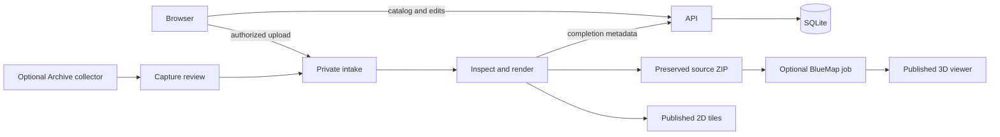

# How Atlas fits together

Atlas keeps locations, dated renders, world downloads and the sources behind
them in one place. The browser is a Blazor application with a Leaflet map. The
API keeps the catalog in SQLite. A separate worker inspects and renders world
downloads so that opening a public page never runs a renderer.

## Where to start in the code

| Project | What it does |
| --- | --- |
| `2b2tAtlas.Client` | Directory, map, editor, admin pages and API clients |
| `2b2tAtlas.Server` | HTTP endpoints, accounts, permissions, SQLite, audit and job queue |
| `2b2tAtlas.Shared` | Data contracts, dimensions, permissions and validation |
| `2b2tAtlas.Ingestor` | ZIP and world inspection, rendering, tile conversion and publication |
| `2b2tAtlas.Ingestor.Tests` | Synthetic worlds, temporary databases and regression tests |
| `tools/AtlasArchiveCoverage` | Fabric companion that tracks received and saved terrain |
| `scripts` | Collection, recovery, BlueMap, backups and research helpers |

Start at `2b2tAtlas.Client/Pages/Home.razor` for the directory,
`2b2tAtlas.Client/Pages/Map.razor` for the map page, or
`2b2tAtlas.Client/wwwroot/js/atlas-map.js` for coordinates and layers. The API starts in
`2b2tAtlas.Server/Program.cs`; the worker starts in `2b2tAtlas.Ingestor/Program.cs`.
The [code map](GLOSSARY_OWNERSHIP.md) lists the individual components.

## A world download's path through Atlas

```mermaid
flowchart LR
    Browser -->|catalog and edits| API
    API --> SQLite[(SQLite)]
    Browser -->|authorized upload| Intake[Private intake]
    Collector[Optional Archive collector] --> Review[Capture review]
    Review --> Intake
    Intake --> Worker[Inspect and render]
    Worker --> Archive[Preserved source ZIP]
    Worker --> Tiles[Published 2D tiles]
    Worker -->|completion metadata| API
    Archive --> BlueMap[Optional BlueMap job]
    BlueMap --> Viewer[Published 3D viewer]
```

The API receives uploads and stores them in private intake. It never extracts
or renders their contents. The worker checks paths, sizes, world structure,
coordinates and renderer output before publishing. Source ZIPs remain unchanged.
A failed job keeps its state and receipts so it can be investigated or resumed.

BlueMap works from completed, preserved sources. It relights a disposable copy,
checks that no chunks were added or lost, and publishes a separate 3D generation.
A failed 3D job leaves the source and 2D render usable. See the
[pipeline](../INGESTION_PIPELINE.md) and [BlueMap guide](../BLUEMAP_PIPELINE.md).

## What you need to run

The example launcher starts the UI and API with a fresh local database. Collectors,
renderers, scheduled jobs and research tools require separate setup. Start with
one worker and your own storage paths; the example drive letters and worker counts
are not hardware requirements. [Runtime setup](RUNTIME_TOPOLOGY.md) explains the
connections, and [authentication](AUTH_SECURITY.md) explains who can change data.

Optional research services can be offline while Atlas continues serving the
catalog. Research results are suggestions for review, never permission to change
coordinates or publish a world.
