# WDL Ingestion Stages, Worker Protocol, Security, And Publication

> **AI-Generated documentation.**

## Scope

This file is the retrieval summary for WDL flow. Commands and limits remain authoritative in `docs/INGESTION_PIPELINE.md`; threat detail is in `docs/INGESTION_SECURITY.md`; operator gates are in `docs/INGESTION_CHECKLIST.md`.

## Production Support Boundary

**Production:** reviewed Overworld, Nether, and End WDLs have certified sparse coordinate schemes. The current corpus baseline in `docs/ROADMAP.md` is 212 location renders with source archives retained by SHA-256.

All three canonical dimensions are certified. Unknown custom/museum dimensions are not certified and are never guessed as Overworld.

Structural validity is not proof of 2b2t origin. `level.dat` names, dates, seeds, and filenames are editable. Public promotion requires reviewed source provenance and coordinate/overlap evidence.

## Staged Pipeline

```mermaid
flowchart LR
    I[inspect ZIP and SHA-256] --> P[prepare immutable snapshot and worlds]
    P --> R[render with pinned uNmINeD]
    R --> A[adapt to certified Atlas scheme]
    A --> V[verify exact tile tree]
    V --> U[publish atomic immutable tree]
    U --> C[complete API transaction]
    C --> L[location plus Render row]
    L -.-> B[BlueMap polling derivative]
    B --> G[quality-gated immutable 3D generation]
```



Each stage requires matching prior state and provenance. Receipts bind job, plan, dimension, renderer identity, arguments, paths, lengths, and bytes. Existing publication destinations are never overwritten.

The dotted BlueMap edge is intentionally outside the ingestion transaction.
The source-backed `Render` is complete and downloadable before 3D work starts;
BlueMap snapshots eligible renders, independently processes every represented
Overworld, Nether, and End dimension, and publishes only after exact-footprint
relighting and manifest validation. A failure or missing derivative cannot
roll back the source, warp, location, or 2D generation. See
[`../BLUEMAP_PIPELINE.md`](../BLUEMAP_PIPELINE.md).

## Archive Collector Intake

The authenticated headless Archive collector is an upstream source, not part of the trusted worker. It catalogs the live `/warps` GUI, merges canonical warp identities with Atlas, captures through Archive World Downloader, validates each finished ZIP into `D:\AtlasExample\Ingest\archive-captures`, and hash-verifies final raw/footprint artifacts into `E:\AtlasExample\WorldDownloads\collector`. A SHA-bound sidecar preserves the exact warp and catalog/capture provenance. Nothing in either storage tier is a job.

Only explicit promotion to `C:\AtlasExample\Ingest\archive-sync\ready` followed by `import-archive-inbox.ps1` calls the worker-protected local-intake route. From that point onward the ZIP is hostile input and follows the same archive limits, immutable SHA storage, report parsing, matching, rendering, publication, and audit path as a browser upload. PowerShell submits explicit UTF-8 bytes, preserves error bodies, checkpoints accepted hashes, and reconciles an exact immutable retry to its already durable job. A collector-supplied category path or suffix such as `@End` is provenance evidence, never permission to bypass dimension/world-root conflicts.

Coordinate-style Archive warps are structured identities, not ordinary prose. Atlas preserves the axis, sign, magnitude, and Nether/End qualifier when naming and matching examples such as `x-1.0m`, `z-0.55m_nether`, and `-1.0m,_1.0m`. Capture dates do not split one highway milestone into duplicate locations. Because several collector jobs can make a confident-new decision before the first one commits, completion revalidates every trusted `new`/`manual-new` Archive identity against the latest location and warp tables; a unique late match converges on that location, while ambiguity fails closed for review.

Numbered recurring events are also structured identities. Archive compound spellings such as `PitFight_11` normalize to the same textual family as Atlas's `Pit Fight 11`, but the iteration number remains identity-bearing: Pit Fight 10, 11, 13, 14, and 15 are separate event sites and may not merge through proximity, an incorrectly owned exact warp, or footprint overlap. The same numbered-iteration guard applies to base series unless an explicit reviewed rule says otherwise.

Archive collection labels and museum-world provenance are not location identities. For example, the `Sky:` prefix identifies a Spawnmason exhibit collection and a trailing `@Spawnmasons` or `@Spawnmason_lodge` identifies provenance; the canonical location leaf is `Hotel Ukraina`, `Bird Asian District`, `Ceiling`, and so on. Different leaves in the same explicit collection must remain separate locations even when the Archive serves them from the same coordinates, surrounding chunks, or render footprint. A trusted Archive capture may use proximity or footprint overlap for automatic attachment only when warp identity or compatible location-name evidence also agrees. Shared museum-world overlap alone never merges distinct exhibits; uncertain cases stop at `needs-match`.

The October 2022 Sky exhibit is a special render profile, not a special identity rule. Minecraft 1.12.2 stores blocks only through Y=255, and the preserved Sky ceiling occupies that top build-limit plane; named child exhibits therefore carry a durable per-job `RenderTopY=254` and render the structures immediately below it. The `Sky:_Ceiling` capture remains uncut. The parent `Sky Masons` location owns exactly the ceiling-visible overview and one Y254 overview, while each named leaf owns its exact Archive warp/WDL and cutaway render. The cutoff is inferred only from the explicit trusted `Sky:` plus `@Spawnmasons` naming contract, never from coordinates or footprint overlap.

The same rule applies to giant containing WDLs. One capture being wholly inside a prior render means those chunks coexisted in that saved world; it does not identify the smaller capture as the prior render's Atlas location. Long-range overlap without compatible warp/name evidence is excluded from suggestions and confidence scoring.

A circular or irregular render edge is not by itself evidence of collector truncation. The saved ZIP, live receive ledger, independent Anvil-header audit, inferred component, and confirmed-void survey ring must be compared. For example, Melongrad's complete 4,096-chunk survey found only 609 non-void source chunks in a central disc and confirmed at least 256 blocks of void around it, so its circular render reflects the Archive's available source WDL rather than a missed scan.

Operational commands and the landing-view/full-footprint distinction are authoritative in `docs/ARCHIVE_SYNC_AUTOMATION.md`.

## Archive Inspection And Preparation

`SecureZipArchive`, `ZipCentralDirectory`, `WorldInspector`, `NbtSummaryReader`, and `ChunkBoundsInspector` under `2b2tAtlas.Ingestor/` enforce archive, entry, ratio, count, path, type, NBT, chunk, and storage bounds.

Supported discovery includes Alpha `c.*.dat`, McRegion `.mcr`, Anvil `.mca`, external `.mcc`, and mixed worlds. Canonical storage roots include `.`, `DIM-1`, `DIM1`, and vanilla namespaced paths under `dimensions/minecraft/`. Region compression IDs 1 gzip, 2 zlib, 3 raw, and 4 Minecraft lz4-java are bounded; custom codec 127 fails closed. Ambiguous archives fail closed and report candidate roots; browser and offline requests may retry with one validated archive-relative `worldRoot`.

Storage dimension is not historical provenance. A museum can import an original 2b2t End or Nether build into its own Overworld or a custom namespace. Chunk paths alone cannot prove the original dimension. Preserve the source catalog entry, warp/room identifier, coordinates, and the source custodian’s dimension attribution. Normalize a custom museum export to one canonical vanilla dimension only after that attribution is established; otherwise do not publish it.

## Renderer Boundary

`RendererRunner` accepts only operator-owned profile argument arrays with `{world}` and `{output}` substitutions. It verifies executable basename and SHA-256, uses `ProcessStartInfo.ArgumentList`, clears the child environment, bounds logs/runtime, and kills the process tree on failure.

An ingestion job may carry an operator-derived `RenderTopY`. The worker removes any profile-level `--topY` for that dimension and appends the job-specific value to both day and night invocations. This keeps special historical cutaways reproducible across retries without weakening the pinned renderer/profile boundary.

The renderer runs before API completion credentials are used. It should execute as a dedicated low-privilege account with no outbound network and no access to Atlas DB, source, or secrets.

## API Upload Protocol

1. An operator holding `renders.manage` creates an owner-bound upload session with metadata and the declared ZIP length.
2. The browser sends ordered 32 MiB chunks with exact offsets. The API caps archives at 32 GiB and expires incomplete sessions after 24 hours.
3. Completion verifies the declared length and ZIP signature, moves the file into intake, SHA-verifies it into `E:\AtlasExample\WorldDownloads\objects`, and queues the job. Deep inspection remains deferred to the worker's prepare stage.
4. WDL bytes stay on example host and the NAS archive; they never touch Namecheap.

## Public Bounded-World Downloads

Collector-produced exact-footprint objects may be downloaded anonymously after successful ingestion. Atlas does not expose the larger raw survey capture, an intake path, or any filesystem path. Eligible warp and location records publish `worldDownloadUrl`, `worldDownloadMetadataUrl`, and `worldDownloadScope=bounded-footprint`; the corresponding routes are:

```text
GET /api/warps/{id}/world-download
GET /api/warps/{id}/world-download.zip
```

The metadata response explicitly reports `isCompleteWorld=false`, `playability=partial-java-save`, the immutable SHA-256 and byte length, and retained chunk count/bounds when known. The ZIP is a structurally playable Minecraft Java save containing only the historical chunks retained for that Archive warp. Opening it normally may generate new terrain outside those chunks, so preservation consumers should work from a copy and prevent chunk generation.

Explicit Archive `@concepts` and `(concept)` captures are preserved, not discarded. Their warp/render/WDL/MCP representations set `isSinglePlayerConcept=true`, render cards display a warning badge, downloaded filenames include `singleplayer-concept`, and WDL metadata warns that the save is an offline creative concept rather than a live 2b2t snapshot. The exact Archive warp remains the authoritative provenance string.

Downloads use byte ranges, digest ETags, and immutable cache headers. A separate small global concurrency queue protects the NAS, collector, and renderer from bulk-download contention; it does not consume the normal JSON API limiter. Missing archive objects fail with `503` instead of returning a broken or substituted file. Only SHA-linked collector records with reviewed Archive-sync provenance are eligible.

Owner: `2b2tAtlas.Server/Controllers/IngestionJobsController.cs` and browser dialogs `2b2tAtlas.Client/Pages/IngestionJobDialog.razor` and `BulkIngestionDialog.razor`.

## Queue And Claim Protocol

`IngestionJobsController` owns the API queue. Admins with `renders.manage` list/create jobs and may cancel only `queued` jobs. The worker calls `POST /api/ingestion-jobs/claim`; oldest eligible work wins.

A claim has a 15-minute lease and random token whose SHA-256 is stored. Running status updates renew the lease. Expired jobs may be reclaimed up to three attempts; after that they fail in stage `lease`. Terminal `completed`, `failed`, and `cancelled` jobs cannot be changed.

Upload-time matching is a preflight state that workers cannot claim. An abandoned `matching` row is recovered to the queue after five minutes, but an unresolved or `review` decision is always fail-closed at completion even if a stale `ExistingLocationId` is present. An inconclusive authoritative prepare pass clears that stale destination before parking at `needs-match`.

## Adaptation And Verification

The adapter requires every chunk-derived native tile, rejects unexpected visible output, prunes only fully transparent padding, retains maximum-detail bytes, and generates floor-aligned parents. Negative coordinates use floor division.

The verifier accepts signed sparse paths but requires exact `z/y/x.ext`, one image extension, zoom 0, contiguous levels, bounded count/bytes, and no links, extras, or duplicate coordinates. Geographic correctness still requires landmarks and overlap review.

## Publication And Completion

`TilePublisher` stages verified day and night trees under a new generation on the publish volume. Completion submits exact bounds, dimension, `MaxNativeZoom`, `CoordinateScheme=atlas-sparse-v1`, SHA-256, `HasDayNight=true`, and an allowed HTTPS `TilesPath` containing `{dn}`.

The API transaction selects a same-dimension existing location or creates one at the exact bounds center, creates or updates one `Render`, records audit, and prevents duplicate `TilesPath`. The database switches to the new generation only after both variants verify; the worker removes the superseded generation afterward. If metadata is wrong, unlink the render before retiring immutable tiles after cache expiry; never overwrite a live tree in place.

## Failure Policy

Fail closed on unknown formats, keys, dimensions, hashes, profiles, paths, URL roots, dates, timeouts, output grammar, or disk reserve. Preserve job state, logs, receipts, and the immutable snapshot for diagnosis. Do not edit receipts to force progress.
